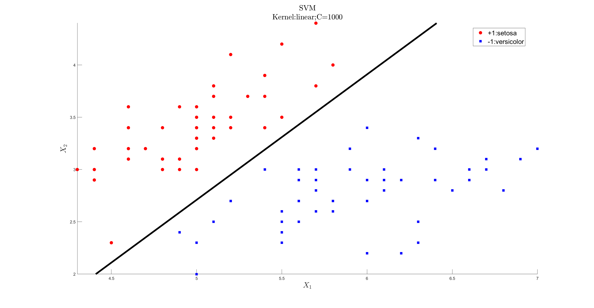
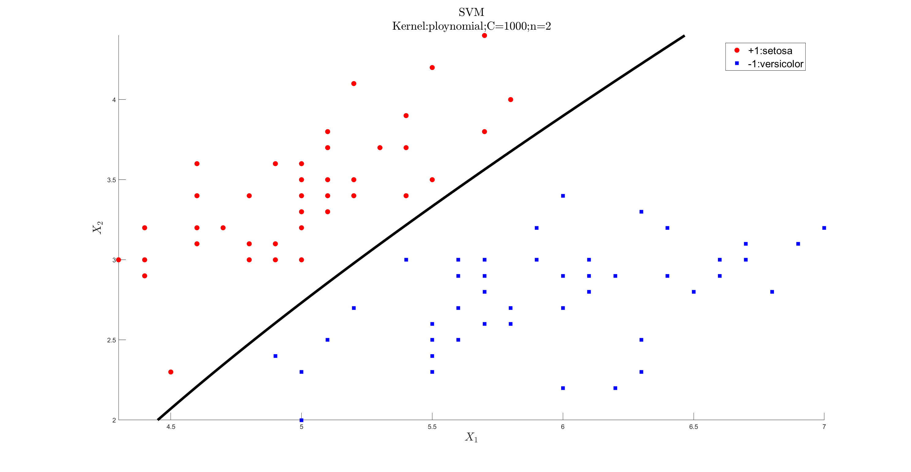
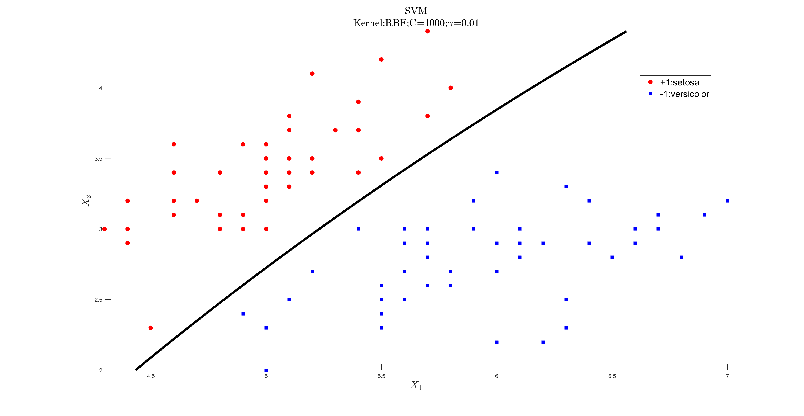
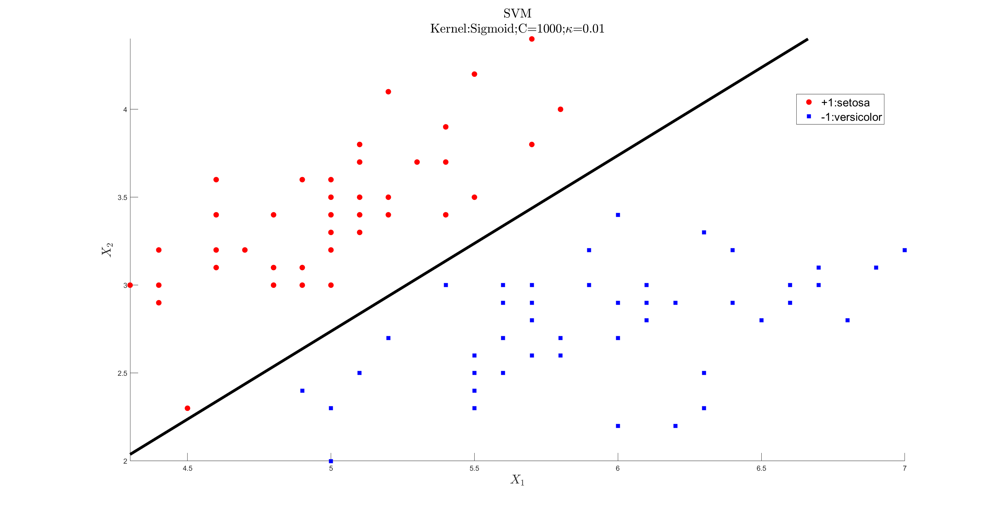
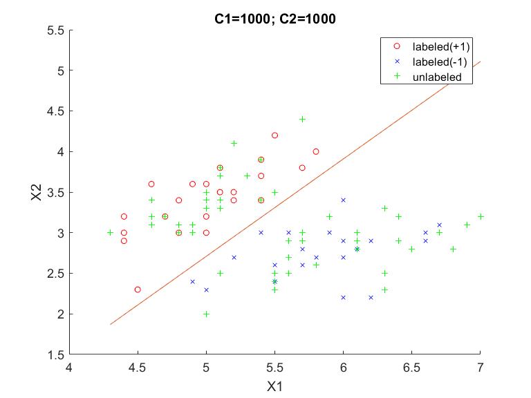

# My own implementation of SVM and TSVM in MATLAB

Here are files of my own implementation of [Support Vector Machine](https://en.wikipedia.org/wiki/Support_vector_machine) (SVM) & Transductive SVM (TSVM) in MATLAB.

## Kernel Method

Kernels used in this project[^1]:

* Linear kernel: ;
* Polynomial kernel: ;
* Gaussian Kernel (RBF): ;
* Sigmoid kernel: ;

## Optimization

The dual problems of SVM is a quadratic optimization problem with linear constraints. So we solved it using [`quadprog` function](https://ww2.mathworks.cn/help/optim/ug/quadprog.html) of MATLAB [Quadratic Programming Toolbox](https://ww2.mathworks.cn/help/optim/quadratic-programming.html).

## Dataset in Demo

MATLAB [sample data set](https://ww2.mathworks.cn/help/stats/sample-data-sets.html) Fisher's 1936 iris data (`fisheriris`) consists of measurements on the sepal length, sepal width, petal length, and petal width for 150 iris specimens. There are 50 specimens from each of three species:

* Setosa,
* Versicolor,
* Virginica.

## SVM

Support Vector Machine (SVM) [Cortes & Vapnuk, 1995] is a supervised learning model.

The following are the demo of SVM:

## Transductive SVM (TSVM)

Transductive SVM (TSVM) [Joachims, 1995] is a semi-supervised learning model.

The following are the demo of TSVM:

## Readings

* [CMU-CS10701-Machine Learning, 2011 by Tom Mitchell: Kernel Methods, SVM](http://www.cs.cmu.edu/~tom/10701_sp11/slides/Kernels_SVM_04_7_2011-ann.pdf)
* [CMU-CS10701-Machine Learning, 2011 by Tom Mitchell: SVM II](http://www.cs.cmu.edu/~tom/10701_sp11/slides/Kernels_SVM2_04_12_2011-ann.pdf)
* [CMU-CS10701/15781-Machine Learning, 2006 by Carlos Guestrin: Transductive SVMs](http://www.cs.cmu.edu/~guestrin/Class/10701-S06/Slides/tsvms-pca.pdf)
* [MACHINE LEARNING WITH MISSING LABELS: TRANSDUCTIVE SVMS by Charles H Martin, PhD](https://calculatedcontent.com/2014/09/23/machine-learning-with-missing-labels-transductive-svms/)

## Other Implementations on GitHub

* [soloice/SVM-python](https://github.com/soloice/SVM-python): Implemented SVM in Python. In particular, the SMO algorithm is implemented.
* [AlexanderFabisch/svm](https://github.com/AlexanderFabisch/svm): Support Vector Machine in Python
* [semisup-learn/methods/scikitTSVM.py](https://github.com/tmadl/semisup-learn/blob/master/methods/scikitTSVM.py): Semi-supervised learning frameworks for python, which allow fitting scikit-learn classifiers to partially labeled data
* [CalculatedContent/tsvm](https://github.com/CalculatedContent/tsvm): experiments testing transductive svm for my blog posts

## Reference

* Cortes, C., & Vapnik, V. (1995). Support-vector networks. Machine learning, 20(3), 273-297.
* Joachims, T. (1999, June). Transductive inference for text classification using support vector machines. In ICML (Vol. 99, pp. 200-209).

---

[^1]: [Kernel Functions for Machine Learning Applications](http://crsouza.com/2010/03/17/kernel-functions-for-machine-learning-applications/#linear)